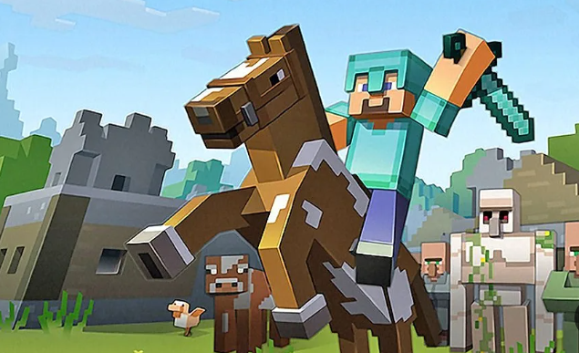
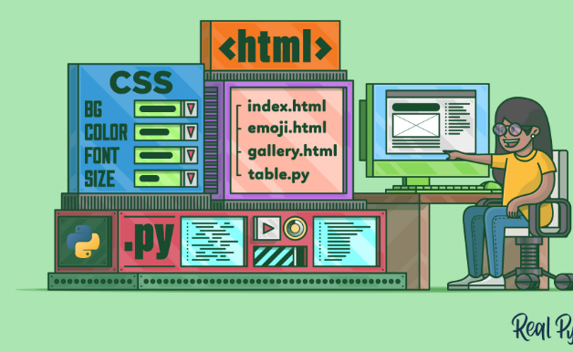
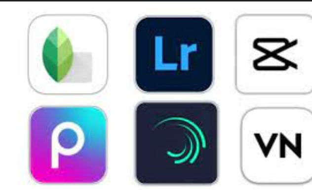
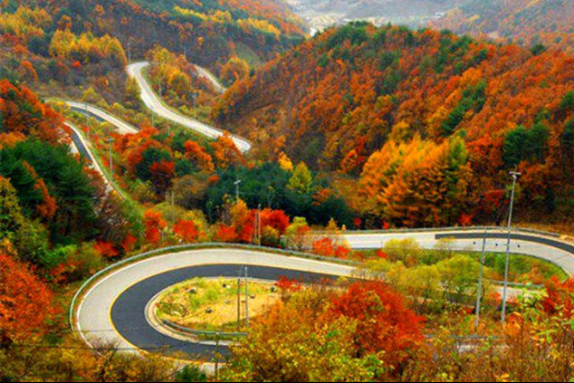
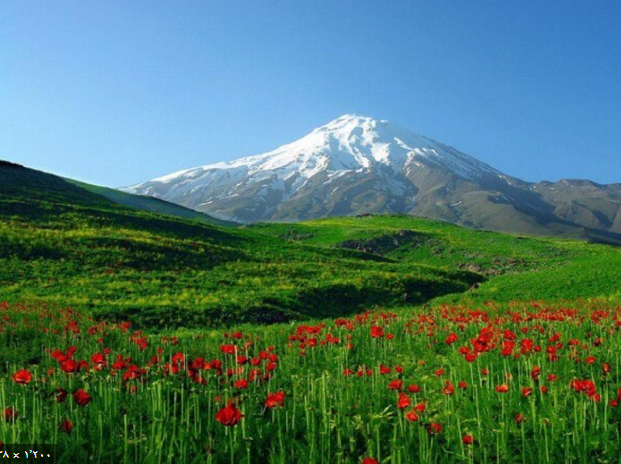
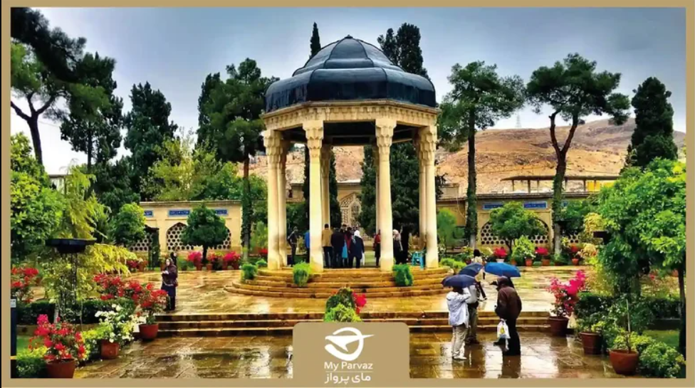

<html lang="fa">
<head>
<meta charset="UTF-8">
<meta name="viewport" content="width=device-width, initial-scale=1.0">
<title>پروژه‌های من</title>
<link href="https://fonts.googleapis.com/css2?family=Vazirmatn:wght@400;700&display=swap" rel="stylesheet">

</head>
<body>

<!-- لودینگ -->

  
Loading Arsam_khosh web...

  

<!-- نوار بالا -->
<nav>
  <a href="#about-me" data-fa="درباره من" data-en="About Me">درباره من</a>
  <a href="#projects-section" data-fa="پروژه‌ها" data-en="Projects">پروژه‌ها</a>
  <a href="#skills-section" data-fa="مهارت‌ها" data-en="Skills">مهارت‌ها</a>
  <a href="#blog-section" data-fa="اخبار" data-en="Blog">اخبار</a>
  <a href="#gallery-section" data-fa="گالری" data-en="Gallery">گالری</a>
  <a href="#contact-section" data-fa="ارتباط" data-en="Contact">ارتباط</a>
  <button id="lang-toggle">EN</button>
</nav>

<!-- ادامه بخش‌ها: درباره من، پروژه‌ها، مهارت‌ها، بلاگ، گالری، FAQ، تماس، فوتر -->
<!-- من ادامه JS و محتوای پروژه‌ها و ترجمه رو هم آماده کردم -->

</body>
</html>
<section id="about-me">
  <h2 data-fa="درباره من" data-en="About Me">درباره من</h2>
  

    

    

      

      سلام! من آرسام خوش‌اخلاق هستم. توسعه‌دهنده وب و علاقه‌مند به تکنولوژی‌ها. عاشق خلاقیت در طراحی و وب و برنامه نویسی هستم و همچنین به ماینکرفت و سایر بازی ها علاقه دارم 🌐✨
      

    

  

</section>

<section id="projects-section">
  <h2 data-fa="پروژه‌ها" data-en="Projects">پروژه‌ها</h2>
  

    

      
      
🎮سرور ماینکرفت 

      

      سرور اختصاصی برای ماینکرفت با پلاگین‌های مخصوص دارم و برای همکاری به اینستاگرام یا بخش ارتباط با ما پیام بده
      

      
Spigot/Bukkit / Minecraft

      <button class="like-btn">❤ 0</button>
      
این پروژه مربوط به سرور ماینکرفت است

    

    

      
      
🌐سایت شخصی 

      

      من به طراحی سایت علاقه دارم و این سایت رو خودم و با کمک دوستم نوشتم
      

      
HTML / CSS / JavaScript

      <button class="like-btn">❤ 0</button>
      
این پروژه سایت شخصی من است

    

    

      
      
🎬ادیت ویدیو 

      

      به ادیت ویدیو علاقه دارم و کارهای خود را در یوتیوب منتشر می‌کنم
      

      
Capcut / Filmora / Shotcut

      <button class="like-btn">❤ 0</button>
      
این پروژه مربوط به ادیت ویدیو است

    

  

</section>

<section id="skills-section" class="skills">
  <h2 data-fa="مهارت‌ها" data-en="Skills">مهارت‌ها</h2>
  

    
سرور ماینکرفت

    

  

  

    
ادیت ویدیو

    

  

  

    
برنامه نویسی

    

  

</section>

<section id="blog-section" class="blog">
  <h2 data-fa="اخبار" data-en="Blog">اخبار و بروزرسانی‌ها</h2>
  
پست هفته: پلاگین جدید سرور ماینکرفت آماده شد!🚀

  
پروژه سایت شخصی من آپدیت شد و بخش بلاگ اضافه شد.🌐

  
ایونت جدید در سرور🚀

</section>

<section id="gallery-section">
  <h2 data-fa="گالری" data-en="Gallery">گالری</h2>
  

    

      
      
ایران/استان مازنداران/جاده زیبای چالوس

    

    

      
      
ایران/استان تهران/کوه دماوند

    

    

      
      
ایران/تهران/برج زیبای آزادی

    

    

      
      
ایران/استان فارس/شیراز/آرامگاه حافظ

    

    

      
      
ایران/اصفهان/سی و سه پل

    

  

</section>

<section class="faq">
  <h2 data-fa="پرسش و پاسخ پر تکرار" data-en="FAQ">پرسش و پاسخ پر تکرار</h2>
  

    
این سایت با چه زبانی ساخته شده؟

    
این سایت با HTML، CSS و JavaScript ساخته شده است.

  

  

    
آموزش به صورت رایگان میدی؟

    
آموزش میدم ولی رایگان نه

  

  

    
میشه بیام توی سرورتون برای کمک؟

    
بله حتما با استفاده از فرم تماس و اینستاگرام به من بگو

  

  

    
سفارش سایت و سرور میگیری؟

    
بله سایت و سرور ماینکرفت براتون می‌سازم ولی در ازای مبلغی

  

</section>
<section id="contact-section">
  <h2 data-fa="ارتباط با من" data-en="Contact Me">ارتباط با من</h2>

  <form id="contactForm" action="https://formspree.io/f/mnngzdlw" method="POST">

    <label for="name" data-fa="نام" data-en="Name">نام</label>
    <input type="text" id="name" name="name" required
      placeholder="your name"
      data-fa-placeholder="نام شما"
      data-en-placeholder="Your name">

    <label for="email" data-fa="ایمیل" data-en="Email">ایمیل</label>
    <input type="email" id="email" name="email" required
      placeholder="arsam.co@example.com"
      data-fa-placeholder="example@example.com"
      data-en-placeholder="example@example.com">

    <label for="phone" data-fa="شماره تلفن" data-en="Phone Number">شماره تلفن</label>
    <input type="tel" id="phone" name="phone"
      placeholder="0912xxxxxxx"
      data-fa-placeholder="0912xxxxxxx"
      data-en-placeholder="+1 234 567 890">

    <label for="message" data-fa="پیام" data-en="Message">پیام</label>
    <textarea id="message" name="message" rows="5" required
      placeholder="your message"
      data-fa-placeholder="متن پیام"
      data-en-placeholder="Your message..."></textarea>

    <button type="submit"
      data-fa="ارسال پیام"
      data-en="Send Message">
      ارسال پیام
    </button>

  </form>
</section>

<footer>
  

    © 2025 — کلیه حقوق مادی و معنوی این وب‌سایت متعلق به آرسام خوش بوده و هرگونه کپی‌برداری، بازنشر یا استفاده بدون مجوز، پیگرد قانونی دارد.
  

  

    نسخه 1.0
  

</footer>

  <footer id="site-footer"></footer>

  <a href="https://instagram.com/arsam.khosh" target="_blank" data-fa="اینستاگرام من" data-en="My Instagram">اینستاگرام من</a>
 

